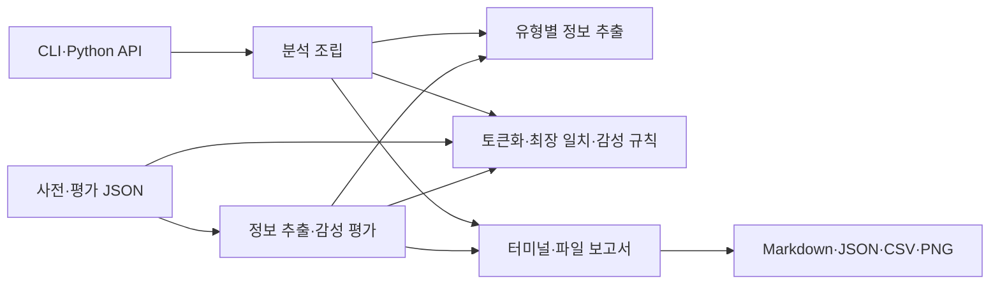

# 정보 추출·감성 분석 엔진

## 프로젝트 소개

규칙 기반 한국어 정보 추출 및 감성 분석 엔진입니다. 이메일·전화번호·날짜·금액·URL을 정규화해 추출하고 감성 사전·강조·부정 규칙으로 문장 점수를 계산합니다.

## 핵심 특징

- 이메일, 전화번호, 날짜, 금액, URL 추출과 유효성 검사
- 추출값 정규화 및 제외 사유(diagnostics) 제공
- 613개 감성 표현의 최장 일치 매칭
- 강조어·부정어·대표 이중부정 처리
- 추출 및 감성 평가, JSON·Markdown·CSV·PNG 결과 저장

## 아키텍처

| 경로 | 역할 |
| --- | --- |
| `src/sentiment_engine/cli.py` | 분석·평가 명령과 출력 형식 선택 |
| `src/sentiment_engine/extraction/` | 유형별 추출·유효성 검사·정규화 |
| `src/sentiment_engine/sentiment/` | 토큰화·최장 일치·강조·부정·감성 점수 |
| `src/sentiment_engine/evaluation/` | 프로젝트 평가 데이터와 지표 계산 |
| `src/sentiment_engine/reporting/` | 터미널·Markdown·JSON·CSV·차트 생성 |
| `src/sentiment_engine/data/` | 패키지에 포함되는 사전·평가 JSON |
| `tests/unit/`, `tests/integration/` | 공개 API·추출·감성·CLI·산출물 계약 |



## 실행 환경과 설치

Python 3.10 이상과 uv를 사용합니다. 개발·CI 기본 버전은 `.python-version`의 Python 3.13입니다. 저장소 루트에서 실행합니다.

```bash
uv sync --frozen
uv run --frozen sentiment-engine --help
```

의존성은 `pyproject.toml`, 설치 버전은 `uv.lock`에서 관리합니다. 사전과 평가 JSON은 wheel에 포함되어 소스 디렉토리 밖에서도 사용할 수 있습니다.

## 실행 방법

문장을 분석합니다.

```bash
uv run --frozen sentiment-engine --text "문의: test@example.com, 결제 금액은 50,000원입니다. 정말 좋지 않아요."
```

평가 데이터를 실행합니다.

```bash
uv run --frozen sentiment-engine --evaluate extraction
uv run --frozen sentiment-engine --evaluate sentiment
uv run --frozen sentiment-engine --evaluate all
```

기본 출력은 터미널에서는 사람이 읽기 쉬운 텍스트이며, 파이프나 리다이렉션에서는 JSON입니다.

```bash
# 저장하지 않고 JSON 출력
uv run --frozen sentiment-engine --text "배송이 빨라요" --format json --no-save

# 결과를 지정한 위치에 저장
uv run --frozen sentiment-engine --evaluate all --output-dir artifacts/reports
```

모듈 실행은 `uv run --frozen python -m sentiment_engine`으로 같은 CLI를 사용합니다.

## Python API

```python
from sentiment_engine.analysis import analyze_text
from sentiment_engine.extraction import extract_information
from sentiment_engine.sentiment import analyze_sentiment

result = analyze_text("배송이 빨라요. 문의는 help@example.com으로 주세요.")
sentiment = analyze_sentiment("정말 좋지 않아요")
extraction = extract_information("결제 금액은 50,000원입니다.")
```

`extract_information()`과 `analyze_sentiment()`의 반환 객체는 `to_dict()`로 JSON 직렬화 가능한 딕셔너리로 변환할 수 있습니다.

## 산출물

명령은 기본적으로 `artifacts/` 아래에 결과를 저장합니다.

- 일반 분석: `summary.md`, `result.json`
- 추출 평가: `summary.md`, `result.json`
- 감성·전체 평가: `summary.md`, `result.json`, `comparison.csv`, `comparison.png`

`--no-save`를 사용하면 파일을 생성하지 않습니다.

## 검증

```bash
make check
make test
make smoke
make build
```

`make test`는 전체 pytest 검사를, `make smoke`는 같은 테스트의 `smoke` 마커를 선택합니다. 임시 경로와 모의 요청으로 실행하며 CI도 같은 잠금 파일·검사·빌드 명령을 사용합니다.

## 해석 범위

이 엔진은 형태소 분석이나 학습 모델을 사용하지 않습니다. 새 표현, 오타, 복잡한 문맥, 반어 및 일반적인 이중부정은 규칙 범위 밖일 수 있습니다.

평가 데이터와 지표, 실패 사례는 [평가 리포트](docs/evaluation-report.md)를 참고하세요.
